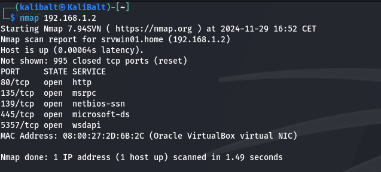

# 📚 Documentation Utilisateur
---
### 📑 Sommaire
- [👁️‍🗨️ Présentation Nmap](#presnmap)
- [📘 Guide Nmap](#guidenmap)
  - [🐣 Utilisation simple](#simplenmap)
  - [🧠 Utilisation avancée](#avancenmap)
  - [⚙️ Utilisation des scripts](#scriptnmap)
- [🔧 Résumé Options](#resumeoptions)
---
### **👁️‍🗨️ Présentation Nmap**
<span id="presnmap"></span>  
**Nmap** est un scanner de ports libre créé par Fyodor. Il est conçu pour **détecter les ports** ouverts, identifier les services hébergés et obtenir des informations sur le **système d'exploitation** d'un ordinateur distant. Ce logiciel est devenu une référence pour les administrateurs réseaux car l'audit des résultats de Nmap fournit des indications sur la **sécurité** d'un réseau.

> Compatible avec la plupart des systèmes d'exploitation, utilisable en ligne de commande ou via interface graphique.
---
## **📘 Guide Nmap**
<span id="guidenmap"></span>
### **🐣 Utilisation simple**
<span id="simplenmap"></span>

Manuel de Nmap
```bash
man nmap
```
Afficher les flags *(options)*
```bash
nmap --help
```
Il est toujours nécessaire d'utiliser `nmap` en premier avant chaque commande pour pouvoir utiliser ses fonctionnalités.

> Quelques exemples de commandes simples avec **nmap** :

Scan rapide des ports d'une target unique
```bash
nmap 192.168.1.2
```
Réponse :



Scan rapide d'un seul port
```bash
nmap -p "port" 198.168.1.2
```
Scan des ports d'un sous-réseau
```bash
nmap 198.168.1.2/16
```
### **🧠 Utilisation avancée**
<span id="avancenmap"></span>
Combine détection d'OS, de versions, scripts et traceroute.
```bash
nmap -A <cible>
```
Scan agressif sur une plage de ports spécifique.
```bash
nmap -A -p 1-1000 <cible>
```
Scan furtif avec analyse des services (scan SYN)
```bash
nmap -p 1-65535 -sS -T4 -A <ip_ou_domaine>
```
Scan de réseau avec détection de topologie
```bash
nmap -sn -T4 --traceroute <plage_d_ip>
```
Scan UDP (Ports fermés ou filtrés avec un scan UDP spécifique)
```bash
nmap -p U:123,161,162 -sU -T4 <ip_ou_domaine>
```
Scan avec identification de firewall (scan de pare-feu)
```bash
nmap -p 1-65535 -sS -sA -T4 <ip_ou_domaine>
```
### **⚙️ Utilisation des scripts**
<span id="scriptnmap"></span>
Nmap permet également l'utilisation de scripts pour effectuer des tâches des choses plus avancées et repousser les limites de nmap aussi loin que possible.
Scripts disponible ici : `/usr/share/nmap/scripts`

Utilisation d'un script
```bash
nmap --scripts "script" <target>
```
> Nous pouvons aussi créer nos propres scripts selon nos besoins.
### **🔧 Résumé Options**
<span id="resumeoptions"></span>
**Le résumé de toutes ces commandes est disponible [ici](https://nmap.org/data/nmap.usage.txt).**
